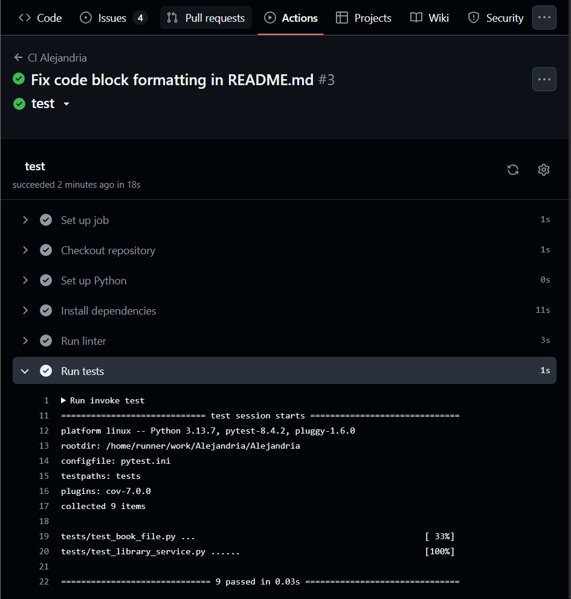

# 🧩 HITO  2: Integración continua

## Elección y configuración de un Gestor de Tareas

Para el gestor de tareas he utilizado **invoke**, que es una biblioteca de Python que te permite ejecutar una serie de tareas definidas en un archivo **tasks.py** similar a como sucedería con un Makefile, pero en lugar de hacer uso de *make* como comando en el terminal para ejecutar las diferentes instrucciones, se hace uso de *invoke + nombre_de_la_tarea*. Pero, ¿por qué **Invoke**?

Básicamente, el lenguaje de programación que estoy usando para **Alejandría** es Python con el IDE PyCharm, por lo que me parecía bastante lógico e intuitivo hacer uso de una biblioteca pensada para el caso de Python, en lugar de hacer uso por ejemplo de un Makefile. Además, en primero de carrera ya usé y programé Makefiles, por lo que me apetecía atreverme con algo que no hubiera usado antes, para así enriquecerme aún más durante este proyecto.

Por otro lado, a diferencia de otros gestores como **GNU Make** que dependen del entorno Unix, **Invoke** sí que presenta portabilidad multiplataforma de forma nativa en Windows y/o macOS. Si bien había otros gestores de tareas como Tox, Nox o Doit, estos tienen una mayor complejidad, lo cual podría no ser del todo ideal en un proyecto de complejidad media-baja como viene siendo esta biblioteca virtual.

Finalmente, y sin querer adelantarme mucho, ni hacer demasiados *spoilers*, este gestor de tareas es totalmente compatible con el sitema de Integración Continua (CI) elegido para el caso: **GitHub Actions**.

```
# Ejemplo de uso de ivoke:
import os
from invoke import task

def _run_pytest(c, cov=False):
    env = os.environ.copy()
    env["PYTHONPATH"] = "src"
    cmd = "pytest -v --maxfail=1 --disable-warnings"
    if cov:
        cmd += " --cov=src --cov-report=term-missing"
    c.run(cmd, env=env)

[...]

@task(name="test")
def run_tests(c):
    _run_pytest(c, cov=False)
    
```


Para el código mostrado, por ejemplo, se definen las instrucciones para ejecutar los tests definidos dentro del directorio test, solo bastaría con ejecutar *invoke test* en el terminal y dentro del directorio raíz del proyecto.

---

## Elección y uso de la biblioteca de aserciones

He decidido usar **pytest** como biblioteca de aserciones para la verificación de resultados en los tests unitarios. ¿Por qué he usado **pytest**? Pues por su simplicidad y amplia adopción en el ecosistema Python y su compatibilidad con GitHub Actions e Invoke.

No tiene pérdida, se hacen uso de los métodos ya incluidos en la biblioteca para comprobar que dos resultados son iguales gracias a *self.assertEqual* lo cual facilita la legibilidad de código y mejora la mantenibilidad. Esta biblioteca sigue la filosofía de Test-Driven Development (TDD).


```
# Ejemplo de uso de assert:
def test_avg_rating_rounding(library):
    library.review_book("Pablo", "Frankenstein", "Top", 5)
    library.review_book("Pablo", "Frankenstein", "Bien", 4)
    book = library.find_book("Frankenstein")
    assert book.average_rating() == 4.5 
```

Alejandría hace uso de TDD (Test-Driven Development), es decir, primero se desarrollan unos tests y luego se desarrolla el código que deberá pasarlos en contraste al BDD (Behavior-Driven Development) que se enfoca en imaginar escenarios para desarrollar el código. Como lo veo yo, gracias al TDD se pueden llevar a cabo proyectos en los que haya involucrados varios programadores ya que si un programador quiere añadir o modificar código debe pasar los tests, cerciorandose así de que no se rompe nada y se garantiza siempre la funcionalidad del programa.

---

## Elección y uso del marco de pruebas

El marco de pruebas elegido también ha sido pytest y las motivaciones detrás de esta elección no varían demasiado de las explicadas en el apartado anterior.

**pytest** ofrece una sintaxis clara y directa, eliminando la necesidad de crear clases o heredar de estructuras complejas como, por ejemplo, en **unittest**. Esta curva de aprendizaje reducida permite al desarrollador centrarse en la lógica de verificación sin depender de configuraciones extensas. Además, no existe *boilerplate code* (código repetitivo).

Por otro lado,  otra de las ventajas de **pytest**, es su sistema de *fixtures*, que permite definir entornos de prueba reutilizables para inicializar objetos, cargar datos o configurar estados antes de cada test.

---

## Elección y funcionamiento del sistema de Integración Continua (CI)

Para el sistema de integración continua (CI), como ya mencioné antes, elegí GitHub Actions, el motivo detrás de esto viene ya tiempo atrás en el Hito 1 donde intentábamos sacar el máximo potencial de GitHub con el uso de issues, milestones, doble factor de autenticación, funcionalidades que nunca había usado antes en mis proyectos, por lo que me parecía el siguiente paso lógico seguir profundizando en las funcionalidades que GitHub tiene que ofrecer, en este caso haciendo uso de su sistema de integración continua gratuito: **GitHub Actions**.

Cada vez que se realiza un commit y un push, GitHub Actions ejecuta las instrucciones especificadas dentro de Alejandria/.github/workflows/ci.yml y muestra el resultado de ejecutar esas tareas. Los resultados pueden comprobarse dentro del apartado *Actions* de nuestro repositorio:



---

## Funcionalidad implementada y que será testeada de Alejandría

Como ya se explicó, en este hito no he implementado funcionalidades de autenticación de usuarios, sino que por el contrario todos los usuarios puede hacer un poco de todo. Actualmente se pueden crear usuarios, pedir libros en préstamos, escribir reseñas, abrir los libros (abrir un visor de pdf), devolver libros, etc.

Finalmente, para este hito y para comprobar todas las funcionalidades implementadas, he hecho 23 tests.
