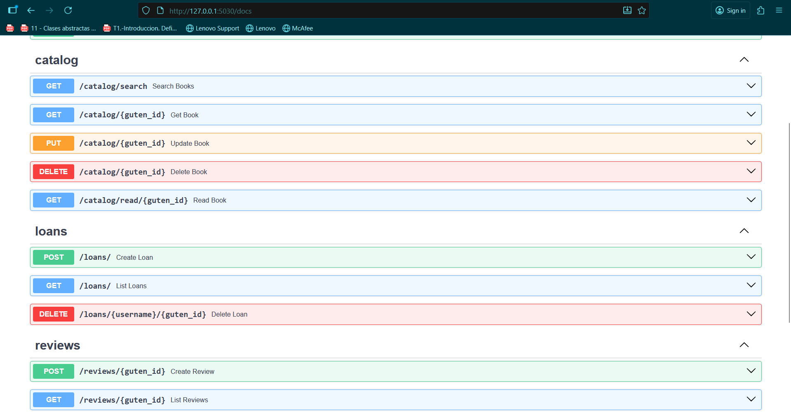
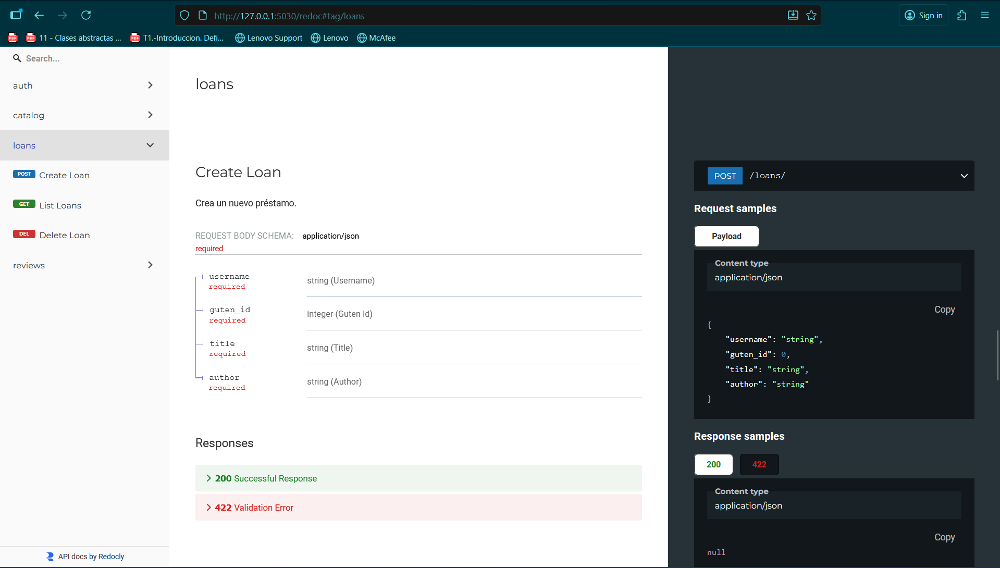
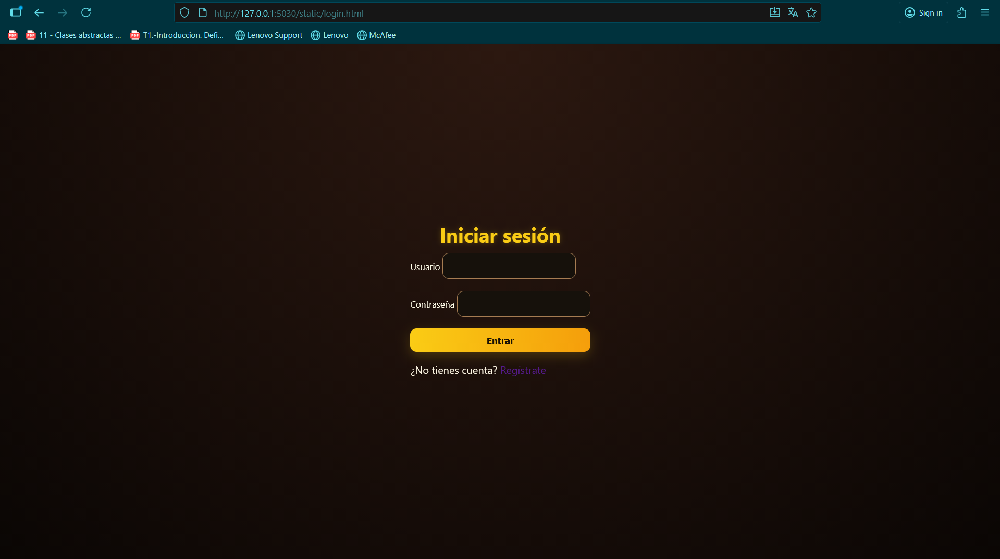
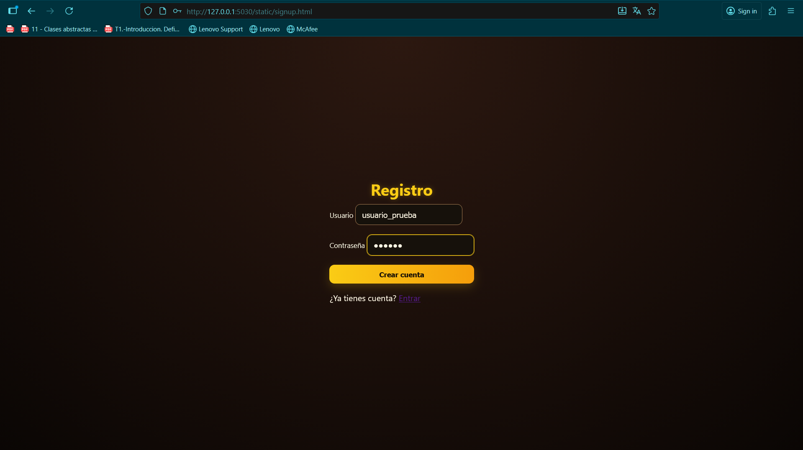
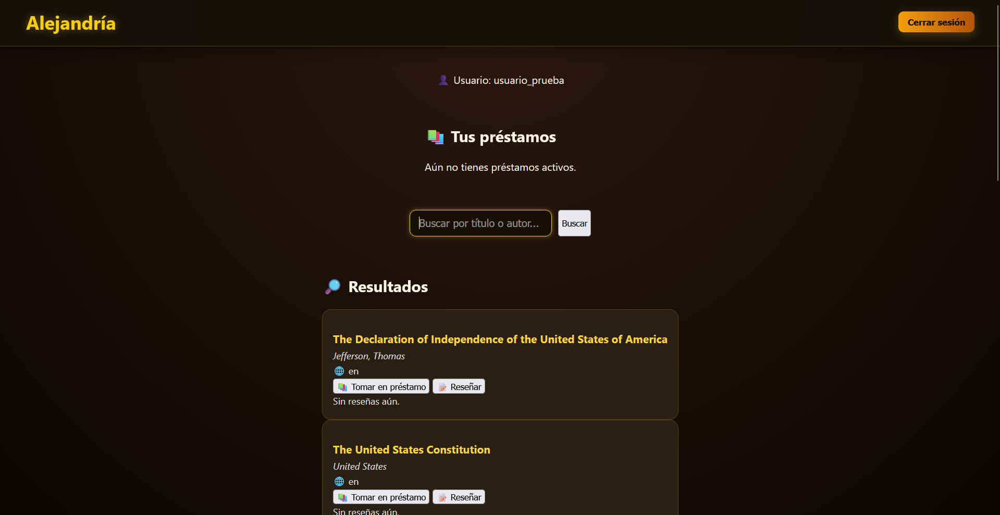
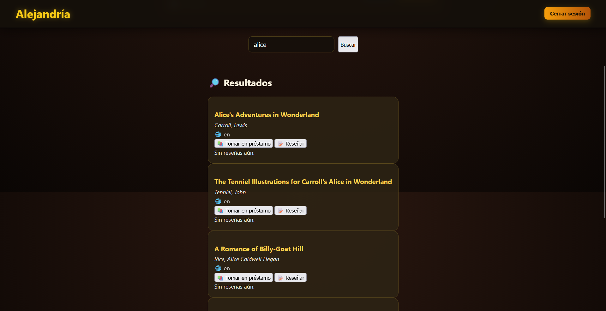

# 🧩 HITO 3: Diseño de microservicios

## FastAPI como framework elegido para crear microservcios

En un principio pensé en utilizar Django para crear los microservicios de mi aplciación Alejandría, pero la curva de aprendizaje resultó ser algo más elevada de lo que estimé en un primer momento.Es por eso que buscando en internet, encontré este foro de Reddit donde este usuario hablaba maravillas sobre FastAPI https://www.reddit.com/r/FastAPI/comments/1bs889k/why_i_chose_fastapi_how_was_my_experience_and/
Los motivos por los que FastAPI es un framework tan querido es porque permite llevar a cabo APIs de forma rápida y efectiva al estar montada por encima de bibliotecas de Python bien diseñadas como Starlette and Pydantic. Por otro lado, he aprovechado la documentación automática generada por Swagger UI (/docs) y ReDoc (/redoc), que permite probar y validar los endpoints de cada microservicio sin necesidad de herramientas externas.




## Diseño en general de la API

He dividido la arquitectura de mi aplicación en 4 microservicios (por el momento), uno que gestiona la autenticación de usuarios dentro del directorio auth, otro que gestiona la visualización y el acceso a los metadatos de los libros dentro del directorio catalog, otro microservicio que gestiona los préstamos de los usuarios (tomar en préstamo y devolver por el momento), dentro de loan y otro microservicio que gestiona la publicación de reseñas para los libros dentro del directorio review.
La API principal (api/main.py) se encarga de montar los routers de cada microservicio dentro de una única aplicación FastAPI, manteniendo el desacoplo entre servicios pero facilitando su integración.
Dentro de cada microservicio, hay tres tipos de archivos: los schemas que definen los modelos de datos y validaciones con Pydantic, los routers, que define las rutas REST y la comunicación HTTP para hacer llamadas a los métodos y los services que implementan la lógica interna de negocio, independiente de la API.

```
# /loan/schemas.py
from pydantic import BaseModel, ConfigDict

class LoanRequest(BaseModel):
    model_config = ConfigDict(from_attributes=True)

    username: str
    guten_id: int
    title: str
    author: str
```

```
# Fragmento de /loan/router.py
logger = logging.getLogger("alejandria_api")

router = APIRouter(prefix="/loans", tags=["loans"])
service = LoanService()

@router.post("/")
def create_loan(req: LoanRequest):
    """Crea un nuevo préstamo."""
    try:
        result = service.create_loan(req.username, req.guten_id, req.title, req.author)
        if not result.get("ok", True):
            raise HTTPException(status_code=400, detail=result["detail"])
        return result
    except HTTPException:
        raise
    except Exception as e:
        logger.exception(f"❌ Error al crear préstamo: {e}")
        raise HTTPException(status_code=500, detail="Error interno del servidor")
```

## Uso de logs para registrar la actividad de la API

He implementado un sistema de logs dentro del archivo alejandria.log en el directorio logs que muestra información acerca de las operaciones efectuadas por la API, además de los diferentes WARNINGS y ERRORS que pudiesen aparecer. Esto es muy útil para detectar errores ya que aumenta la trazabilidad de la aplicación.

```
import logging

logging.basicConfig(
    filename="logs/alejandria.log",
    level=logging.INFO,
    format="%(asctime)s - %(levelname)s - %(message)s"
)

logger = logging.getLogger("alejandria_api")
logger.info("🔧 Servicio de préstamos inicializado correctamente")
logger.error("❌ Error al devolver libro 12: préstamo no encontrado")
```

## Correcta ejecución de los tests

He diseñado nuevos tests, ya que al haber realizado cambios a nivel de arquitectura del proyecto y cambios de funcionalidad, los tests del Hito 2 ya no me servían, por lo que he desarrollado un test_api para testear el funcionamiento de la API y otros tests para testear la funcionalidad de los servicios de los microservicios.

``` 
# Uno de los nuevos tests: 
def test_03_search_catalog():
    res = client.get("/catalog/search?q=test")
    assert res.status_code == 200
    data = res.json()
    assert isinstance(data, dict)
    assert "results" in data
    if len(data["results"]) > 0:
        first = data["results"][0]
        assert "title" in first
```

Seguimos haciendo uso de **GitHub Actions** y de ***invoke test*** como venía sucediendo en el Hito 2.

## Otros aspectos a tener en cuenta

Se han descargado los libros de la biblioteca Gutenberg que es un proyecto sin ánimo de lucro donde se almacenan libros sin derechos de autor que pertenecen al dominio público. En un principio mi intención era que Aljandría fuese un visor de Gutendex, la API del proyecto Gutenberg, pero no se podía hacer de forma directa sin que descargara los libros antes, por lo que importé una gran cantidad de libros (se pueden importar más sin problema alguno) y ya desde local mi aplicación permite a los usuarios tomar prestados los libros y abrirlos. Tengo que limitar todavía que solo puedan tener 5 usuarios (se podría aumentar en caso de que más usuarios usen mi aplicación de forma simultánea) un libro al mismo tiempo. Esto en realidad no hace falta, pero creo que es un detalle gracioso, simular el funcionamiento de una biblioteca real.

## Ejecución y testeo de la aplicación

Para poder probar la versión actual de la aplicación, he implementado un humilde frontend para no depender del terminal para realizar las peticiones (aunque también se podría hacer así). Para poder verlo en nuestra máquina local basta con ejecutar server.py y acceder a la dirección IP indicada en el terminal. Esto nos llevará a la página de inicio de sesión, nos creamos un usuario si no tenemos ninguno e introducimos nuestras credenciales, entonces podremos pedir libros prestados, leerlos, devolverlos y escribir una reseña si nos apetece. Dentro del visor del libro se podrá ajustar el tamaño de la letra, cambiar a modo oscuro y cambiar la fuente de la letra (más funcionalidad en camino).








Aunque en este hito no haya implementado las funcionalidades de bibliotecarios y admins, los usuarios ya tienen un campo que dictamina su rol dentro del sistema.